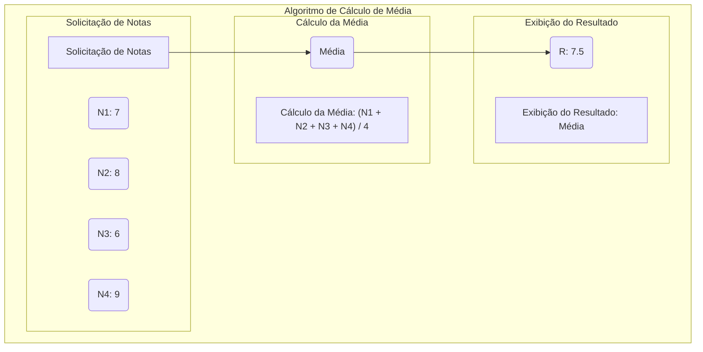

# Diagrama de Fluxo representando um algorítmo em Diagrama de Chapin

O tipo de gráfico utilizado no exemplo é um diagrama de fluxo, que é um dos tipos de gráficos suportados pela linguagem Mermaid. Especificamente, o gráfico de fluxo é criado com a diretiva graph, que define um gráfico de fluxo direcionado onde os nós (caixas) são conectados por setas que indicam a direção do fluxo.

Dentro do gráfico de fluxo, são usadas subgrafos (subgraph) para agrupar conjuntos de nós relacionados. Cada subgrafo pode conter nós individuais (como as caixas de notas e etapas do algoritmo neste caso) e textos explicativos.

Mermaid é uma linguagem de descrição de diagramas que permite criar vários tipos de diagramas, como diagramas de fluxo, diagramas de sequência, diagramas de Gantt, entre outros. É muito popular para criar diagramas em documentos Markdown, como aqueles usados em repositórios do GitHub ou em páginas wiki.

