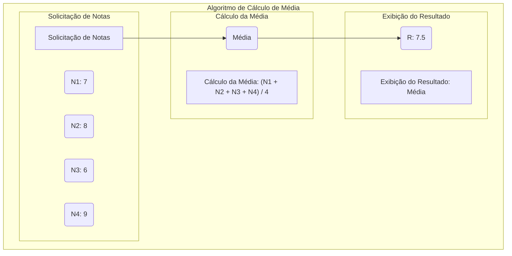

```mermaid
graph TD;
    subgraph "Algoritmo de Cálculo de Média"
        subgraph "Solicitação de Notas"
            EntradaNota1(N1: 7) & EntradaNota2(N2: 8) & EntradaNota3(N3: 6) & EntradaNota4(N4: 9);
            SolicitaçãoNotas[Solicitação de Notas]
        end
        subgraph "Cálculo da Média"
            CalculoMédia(Média);
            CálculoMédiaTexto["Cálculo da Média: (N1 + N2 + N3 + N4) / 4"]
        end
        subgraph "Exibição do Resultado"
            ExibiçãoResultado(R: 7.5);
            ExibiçãoResultadoTexto["Exibição do Resultado: Média"]
        end
        SolicitaçãoNotas --> CalculoMédia;
        CalculoMédia --> ExibiçãoResultado;
    end


```
