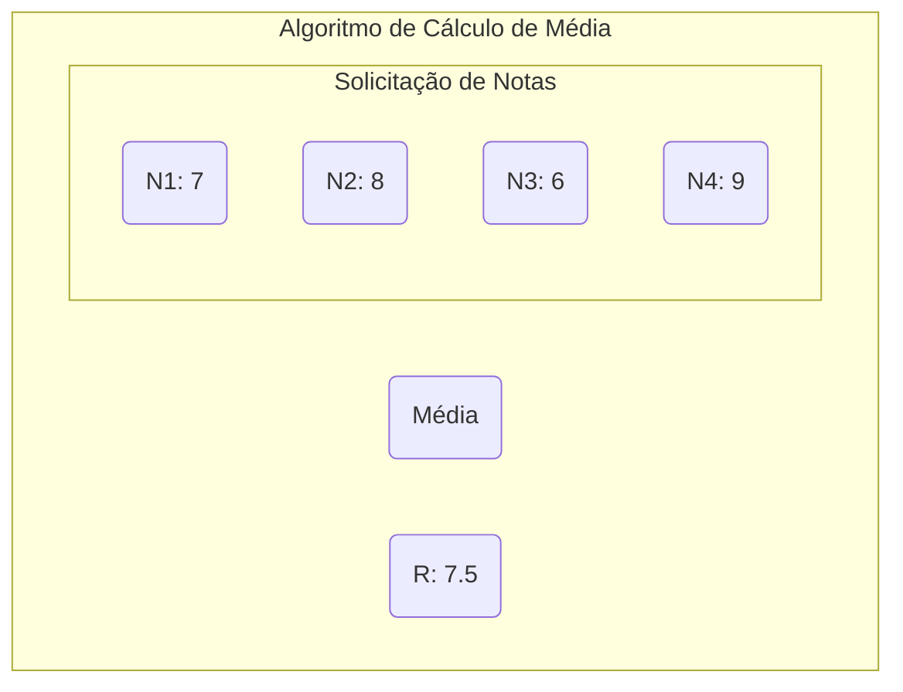

```mermaid
graph TD;
    subgraph Algoritmo de Cálculo de Média
        subgraph Solicitação de Notas
            EntradaNota1(N1: 7) & EntradaNota2(N2: 8) & EntradaNota3(N3: 6) & EntradaNota4(N4: 9);
        end
        CalculoMédia(Média);
        ExibiçãoResultado(R: 7.5);
    end


```
