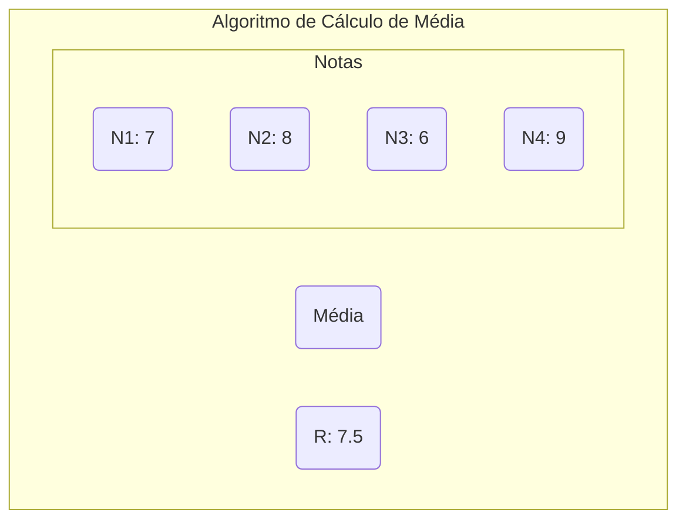

```mermaid
graph TD;
    subgraph Algoritmo de Cálculo de Média
        subgraph Notas
            Nota1(N1: 7) & Nota2(N2: 8) & Nota3(N3: 6) & Nota4(N4: 9);
        end
        Média(Média);
        Resultado(R: 7.5);
    end


```
